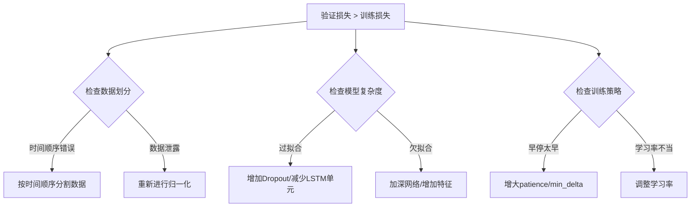

# 宏观经济指标对股市影响的机器学习分析


### 主要内容

​	收集宏观经济指标数据，包括`CPI、PPI和PMI`，以及股市相关数据。 使用机器学习方法分析宏观经济指标对股市的影响，探索不同经济指标与股市表现之间的关系。 构建预测模型，预测宏观经济指标变化对股市的潜在影响，并进行实证分析。


### 研究步骤：

1、数据收集：

​	收集宏观经济指标数据，包括`CPI、PPI和PMI`，以及股市相关数据。从国家统计局官方网站获取月度统计数据，同时使用如`akshare`库来收集股市数据。

2、特征工程：

​	对收集到的数据进行预处理，包括数据清洗、缺失值处理、异常值检测等。然后，提取与宏观经济指标和股市表现相关的特征，这些特征可能包括宏观经济指标的历史值、变化率等。

3、模型选择：

​	根据研究目标选择合适的机器学习模型。使用历史数据训练机器学习模型，并使用验证集评估模型的预测效果。可以采用交叉验证等方法来优化模型参数。

4、模型评估：

​	评估模型的性能，包括预测准确性、稳定性等。使用均方误差`（MSE）`、平均绝对误差`（MAE）`等指标来衡量模型的预测性能。

5、实证分析：

​	基于模型的预测结果，进行实证分析，探索不同经济指标与股市表现之间的关系。


### 1.宏观经济指标收集

####  PPI（生产者价格指数）

------

**定义与含义：**

- **PPI（Producer Price Index）** 是衡量生产领域产品出厂价格变动的指标，反映厂商在批发阶段或生产过程中所收到的平均价格变化水平。
- PPI 主要关注批发价和中间投入品的价格变动，它从生产者的角度反映成本压力和价格传导机制。

**经济意义：**

- **成本传导与通胀预警：** 当 PPI 持续上升时，反映原材料、加工和运输等成本上升的趋势，这可能会传递到消费者，进而推动 CPI 上涨，从而对通胀形成预警。
- **利润和行业景气：** 如果生产者成本上升而产品价格没有同步上涨，那么企业利润可能受到压缩，这对全行业的盈利水平和投资决策是一个警示信号。
- **供给侧压力：** 有时 PPI 下降，也可能反映生产过剩、需求疲软或者产业竞争加剧。

#### CPI（消费者价格指数）

------

**定义与含义：**

- **CPI（Consumer Price Index）** 是衡量居民家庭所消费的一篮子商品和服务价格变动幅度的指标。
- 它反映了普通消费者层面上生活成本的变化，主要涵盖食品、服装、住房、医疗、交通等日常消费品及服务价格。

**经济意义：**

- **通胀水平的核心指标：** CPI 是衡量通货膨胀水平的重要数据。中央银行和决策机构常用 CPI 来评估货币政策的效果、调整利率目标以及进行经济宏观调控。
- **居民生活成本：** 由于 CPI 与居民生活成本紧密相关，政府和社会各界也通过 CPI 来衡量居民实际购买力和生活水平变化。
- **预期管理：** CPI 数据的发布时间和数值常会影响市场预期和消费者信心指数，从而进一步影响经济活动

**判定基准：**

- 一般来说，各国的中央银行会设定一定的通胀目标（例如美国联邦储备目标通胀率大约在 2% 左右），如果 CPI 年化增速远高于或低于目标水平，可能会触发央行的宽松或紧缩政策。
- 还常用月环比、同比来追踪价格走势，看是否存在突然的暴涨或暴跌情况。

#### PMI（采购经理人指数）

------

**定义与含义：**

- **PMI（Purchasing Managers’ Index）** 是通过对制造业（或服务业）中采购经理人进行调查，综合采集新订单、生产、就业、供应商交货时间和库存等多个分项信息后，计算得出的一个综合性指标。
- PMI 的数值一般在 0～100 之间波动，其中 50 被视为扩张和收缩的分界线。

**经济意义：**

- **前瞻性指标：** PMI 通常是一个领先指标，能较早反映出经济活动变化的迹象。例如，当 PMI 大于 50 时，表明制造业或服务业处于扩张阶段；反之，则说明行业可能出现萎缩。
- **制造业健康状况：** PMI 数据能反映订单、生产和就业的情况，是观察经济运行状态的重要窗口，尤其对于出口导向型经济体，制造业 PMI 往往具有较高的参考价值。
- **细分分项观察：** 除了整体 PMI，很多报告还会公布分项数据（例如新订单指数、生产指数等），帮助分析经济中哪些领域正在走强或走弱。

**判定基准：**

- **50 作为分界点：** PMI 指数大于 50 通常被视为经济扩张，低于 50 则意味经济活动处于收缩状态。
- 分析时会结合月度数据、同比变化以及各分项的表现，综合判断未来产业景气度与经济走势。


1. **先行指标（Leading Indicators）**：
   - **PMI（采购经理指数）**：PMI通常被视为先行指标。它通过对采购经理的调查来反映经济活动的变化趋势，特别是制造业和服务业的活动水平。PMI的变化通常可以预示未来几个月的经济活动变化。
2. **同步指标（Coincident Indicators）**：
   - **CPI（消费者价格指数）**：CPI通常被视为同步指标。它衡量的是消费者购买的一篮子商品和服务的价格变化，反映当前的通货膨胀水平。CPI的变化与当前的经济活动密切相关。
   - **PPI（生产者价格指数）**：PPI也通常被视为同步指标。它衡量的是生产者在生产过程中购买的商品和服务的价格变化，反映当前的生产成本变化。PPI的变化与当前的经济活动密切相关。
3. **滞后指标（Lagging Indicators）**：
   - CPI和PPI在某些情况下也可以被视为滞后指标，因为价格变化通常需要一段时间才能反映经济活动的变化。例如，通货膨胀的变化可能滞后于经济活动的变化。


|      名称      | 代码  |
| :------------: | :---: |
| 消费者价格指数 | `CPI` |
| 生产者物价指数 | `PPI` |
| 采购经理人指数 | `PMI` |

------


### 2.股票指数收集：

#### 数据来源：

[行情中心：国内快捷全面的股票、基金、期货、美股、港股、外汇、黄金、债券行情系统_东方财富网](https://quote.eastmoney.com/center/hszs.html)

------


|     指数     |                          代码                          |
| :----------: | :----------------------------------------------------: |
|  `上证指数`  | [000001](https://quote.eastmoney.com/unify/r/1.000001) |
|  `深证成指`  | [399001](https://quote.eastmoney.com/unify/r/0.399001) |
| `创业报指数` | [399006](https://quote.eastmoney.com/unify/r/0.399006) |
|   `科创50`   | [000688](https://quote.eastmoney.com/unify/r/1.000688) |
|  `沪深300`   | [000300](https://quote.eastmoney.com/unify/r/1.000300) |
|  `中证A50`   | [930050](https://quote.eastmoney.com/unify/r/2.930050) |
|  `中证500`   | [000905](https://quote.eastmoney.com/unify/r/1.000905) |
|  `中证1000`  | [000852](https://quote.eastmoney.com/unify/r/1.000852) |


#### 2.1主要的股票指数

|  指数名称   |    编制机构    |    涵盖市场    |              主要特点              |
| :---------: | :------------: | :------------: | :--------------------------------: |
|  上证指数   | 上海证券交易所 | 上海证券交易所 | 涵盖所有上市股票，反映整体市场表现 |
|  深证成指   | 深圳证券交易所 | 深圳证券交易所 |       反映深圳市场成分股表现       |
|  创业板指   | 深圳证券交易所 |   创业板市场   |        专注于成长型创新企业        |
| 沪深300指数 |  中证指数公司  |    沪深两市    |           反映大盘股表现           |
| 中证500指数 |  中证指数公司  |    沪深两市    |         反映中小型企业表现         |

​	这些指数不仅为投资者提供了市场表现的参考，也是研究中国经济和金融市场的重要工具。每个指数都有其独特的构成和特点，反映了不同市场和板块的动态。投资者在做出投资决策时，通常会参考这些指数的表现，以更好地理解市场趋势和风险。


### 3.建表属性字段：


下面分别为每个表的字段属性，包含字段名称、字段属性以及中文说明的信息。

---

#### indicator 表

| 字段名称    | 字段属性                   | 字段中文说明                              |
| ----------- | -------------------------- | ----------------------------------------- |
| id          | `BIGINT`, PRIMARY KEY      | 主键                                      |
| name        | `VARCHAR(50)` NOT NULL     | 指标名称（如“中国CPI月率报告”）           |
| code        | `VARCHAR(20)` DEFAULT NULL | 指标代码/简写（如 “CPI”）                 |
| description | `TEXT` DEFAULT NULL        | 其他说明信息                              |
| frequency   | `VARCHAR(20)`              | 指标频率（'daily'，'monthly' ，'yearly'） |
| created_at  | `DATETIME`                 | 创建时间                                  |
| updated_at  | `DATETIME`                 | 更新时间                                  |

---

#### macro_data 表 

| 字段名称       | 字段属性                     | 字段中文说明                      |
| -------------- | ---------------------------- | --------------------------------- |
| id             | `BIGINT`, PRIMARY KEY        | 主键                              |
| indicator_id   | `BIGINT` NOT NULL            | 关联 indicator 表的 id            |
| report_date    | `DATE` NOT NULL              | 数据对应日期（例如 '1996-02-01'） |
| current_value  | `DECIMAL(10,2)` DEFAULT NULL | 今值（当前值）                    |
| forecast_value | `DECIMAL(10,2)` DEFAULT NULL | 预测值                            |
| previous_value | DECIMAL(10,2) DEFAULT NULL   | 前值                              |
| created_at     | `DATETIME`                   | 创建时间                          |
| updated_at     | `DATETIME`                   | 更新时间                          |

---

#### stock_data 表

| 字段名称        | 字段属性                     | 字段中文说明           |
| --------------- | :--------------------------- | :--------------------- |
| id              | `BIGINT`, PRIMARY KEY        | 主键                   |
| indicator_id    | `BIGINT` NOT NULL            | 关联 indicator 表的 id |
| trade_date      | `DATE` NOT NULL              | 交易日                 |
| open_price      | DECIMAL(15,3) DEFAULT NULL   | 开盘价                 |
| close_price     | `DECIMAL(15,3)` DEFAULT NULL | 收盘价                 |
| high_price      | `DECIMAL(15,3)` DEFAULT NULL | 最高价                 |
| low_price       | `DECIMAL(15,3)` DEFAULT NULL | 最低价                 |
| volume          | `INT` DEFAULT NULL           | 成交量（单位: 手）     |
| turnover_amount | `DECIMAL(20,3)` DEFAULT NULL | 成交额（单位: 元）     |
| amplitude       | `DECIMAL(10,3)` DEFAULT NULL | 振幅（单位: %）        |
| change_rate     | `DECIMAL(10,3)` DEFAULT NULL | 涨跌幅（单位: %）      |
| change_amount   | `DECIMAL(10,3)` DEFAULT NULL | 涨跌额（单位: 元）     |
| turnover_rate   | `DECIMAL(10,3)` DEFAULT NULL | 换手率（单位: %）      |
| created_at      | `DATETIME`                   | 创建时间               |
| updated_at      | `DATETIME`                   | 更新时间               |

---


## 4.数据清洗

### 4.1.数据缺失处理

1. **时间序列中数据缺失常见的原因**：

   1. 传感器或设备故障
   2. 数据采集不连续
   3. 数据传输或者存储错误
   4. 人为错误
   5. 时间间隔不一致 
   6. 数据清洗或者预处理
   7. 隐私或安全考虑
   8. 数据合并或整合问题
   9. 外部环境影响

2. **处理时间序列数据缺失的问题常用方法**

   1. 填补法
       • 根据对整个数据集的观察，对缺失的数据进行填补
   2. 插值法

     • 使用邻近的数据点来估算缺失值
     • 插值法可以算是填补法的另一种形式
   3. 删除受影响的时间段
       • 选择完全不使用含有缺失数据的时间段

3. **缺失数据处理——前向填充法**

   - 前向填充法 （forward fill，简称 ffill） 用前一个有效值来填充缺失值 DataFrame.fillna(method='ffill')

4. **缺失数据处理——移动平均法**

   - 移动平均法 （ moving average）检查当前窗的最后一个值（当前时刻的值）是否缺失，如果不缺失，则保留该值；否则，计算前面值和当前值的均值

5. **缺失数据处理——线性插值法**

   - 线性插值法 （ linear interpolation）用两点之间的直线来估计未知点的值 

     DataFrame. interpolate(method='linear')

6. **缺失数据处理——样条插值法**

   - 样条插值法 （ spline interpolation）用低次多项式（通常是三次多项式）在数据点之间拟合平滑曲线
     DataFrame. interpolate(method=‘spline')

7. **方法的选择**

   - **插值**: 适用于数据变化平稳且缺失值较少的情况。
   - **前向填充**: 适用于数据具有趋势性且缺失值较多的情况。
   - **后向填充**: 适用于数据具有趋势性且希望使用未来值填补的情况。

### 4.2 数据采样

#### 4.2.1 下采样

​	下采样的主要目的是用于降低时间戳的频次

1. 适用情况
   - 数据的原始分辨率不合理
   - 关注季节性和周期性的特定部分
   - 以较低的频率匹配数据
2. pandas中实例
   - dataFrame.iloc[::12] 中的 ::12 意味着从 DataFrame 中每12 行选取一行，起始行默认从 0 开始

#### 4.2.2 上采样

​	上采样的主要作用是提高数据的频次

1. 适用情况
   - 不规则的时间序列
   - 输入数据的采样频次不同
   - 了解时间序列的动态性
2. pandas中实例
   - 使用 `merge_asof` 函数进行匹配和合并，其中 `direction='backward'` 意味着在没有精确匹配的情况下，使用最近的过去日期进行匹配

### 4.3数据平滑

​	数据平滑的主要目的是为了减少数据集中的噪声

1. 主要实现方法有：
   - 移动平均：取相邻观测值的平均值来平滑数据
   - 指数平滑：对最近的观测值赋予更大的权重
   - 指数平滑：对最近的观测值赋予更大的权重


## 5.特征工程


-  数据获取
  - 通过获取到股票的数据，和宏观数据，并且进行数据清洗，异常值分析
- 时序的特征工程：
  - 提取基础的时间特征，包括年月日等
  - 滞后和移动统计特征
    - 滞后特征：用先前的时间点的数据作为当前时间点的特征（例如，前一天的值，前一周的值等）
    - 滑动统计特征：通过计算给定时间窗口内的统计量（如均值、标准差、最大值、最小值等）来捕捉时间序列中的趋势和波动
    - `pandas.Dataframe.shift (i)`：将数据向前移动 𝑖𝑖 个位置，表示前 𝑖𝑖 天的值
    - `pandas.Dataframe.rolling(i)`:对一个长度为 𝑖𝑖 的时间窗口内的数据进行计算
  - 差分特征：主要是用于消除数据在时间序列中的趋势，使其更加平稳
    - 一阶差分 ：消除时间序列中的线性趋势
    - 二阶差分：消除时间序列中更复杂的趋势
    - 季节性差分 ：消除时间序列的季节性成分
    - `pandas.Dataframe.diff()`：
      periods：表示计算差分的间隔（时间步），默认值为 1
      axis：指定沿哪个轴进行差分计算，axis=0 表示对行进行差分（默认）
  - 外部特征和特征事件
    - 天气、经济、市场等因素
      - **引入天气数据（如温度、湿度、降水量等）**
      - **经济数据（如利率、GDP增长率等）**
      - **市场数据（如股票价格、交易量等）**
    - 假期和事件特征
      - 特定行业（如零售、旅游等）可能会受到节假日、促销活动等特殊事件的影响
    - `holidays` 用于生成全球多个国家和地区假期的 Python 库
    - `meteostat` 用于获取全球天气和气候数据的 Python 库
    - `pandas_datareader` 用于从多个来源（如 Yahoo Finance、FRED、World Bank）读取金融数据的库
- **特征转换**：

- **分解模型：**


## 5. 检测异常值

**Z 分数计算原理**

- **公式**：

$$
z= \frac{x - \mu}{\sigma}
$$

其中：

- $$
  x 是单个数据点。
  \mu 是数据的均值。
  \sigma 是数据的标准差。
  $$

  

- **意义**：   Z 分数表示某个数据点与均值之间的偏离程度，用标准差来衡量。   在正态分布中，大约 99.7% 的数据会落在 [−3,3] 的区间内。当一个点的 Z 分数绝对值超过 3 时，可以认为它落在了统计上非常罕见的位置，从而被标记为异常值。


 **箱线图原理**

- **四分位数**：箱线图根据数据的 25% 分位数（第一四分位数 `Q1`）、中位数（第二四分位数）和 75% 分位数（第三四分位数 `Q3`）来描述数据分布。
- **四分位距（IQR）**：`IQR = Q3 - Q1`，用于衡量数据的集中程度。通常认为任何落在 `[Q1 - 1.5 * IQR, Q3 + 1.5 * IQR]` 范围之外的数据点为异常值。

## 6.**股票和宏观特征的关系**

**CPI：** 可以通过相邻两期的CPI计算通胀率 pct_change()
$$
通货膨胀率 = \frac{CPI_t - CPI_{t-1}}{CPI_{t-1}} \times 100
$$
将原始 CPI 数据转化为一个经济指标——通胀率，便于与其他宏观经济数据及股票市场数据对比，观察通胀率变化对市场的影响。


------


## 7.具体实现业务

### 7.1.模型训练前期

#### a.早期已完成任务：

- [x] 构建`FastAPI Web`框架
- [x] 初始化项目，完善基础web开发需要的脚手架
- [x] 引入`ORM`框架进行开发
- [x] 寻找宏观数据源和股票数据源 `AKShare`
- [x] `AkShare`进行测试，爬取数据
- [x] 观察数据结构，定义`SQL`数据结构表
- [x] 抓取数据，进行初步的数据清洗
- [x] 书写基本的业务 `BaseSQL`
- [x] 数据清洗后完成入库
- [x] 完成数据的导出和转换，方便后期应用 `pandas.DataFrame`格式
- [x] 优化代码，初期排错，保证项目正常运行

#### b.后续任务安排

**4/17**

- [x] 调整 stock_data `SQL`表结构和数据模型
- [x] ~~调整爬虫代码，进行数据爬取~~ 从`AkShare`获取数据
- [x] 观察数据结构，进行数据清洗后入库
- [x] ！入库分新增和更新注意业务逻辑
- [x] 新增导出数据的方法`SQL`库中查询后封装`excel`返回到接口

- [x] 业务方法更新数据策略

  - 增量更新：从数据库查询，有没有该indicator_id 下的数据 如果有那么就是增量更新
    - 通过数据条数判断，更新的时候直接截断
    - 数据库查询出对应的这条数据，筛选出最新的日期，和`dataFrame`中的日期比较。入库比数据库更新的数据

  - 全量更新
    - 直接构造对象，批量创建。


**4/18**

- [x] 业务流程简化
- [x] 生成单元测试，修复bug
- [x] 完成web调用开发
- [x] 优化更新代码，还需要求出一个最小值，小于的部分也应该继续更新

**4/19**

- [x] 书写定时任务，检查插入问题，indicator_id=1的问题(偶发不好定位)
- [x] 定时任务，清空生成的文件
- [x] 定时任务，自动更新数据集
- [x] 优化获取DB的连接方式
- [x] 书写批量导出excel文件(已使用策略模式实现)
- [x] 书写批量更新数据的方法

**4/20**以后

- [x] 构建前端项目
- [x] 着手训练数据模型
- [x] 数据分析，数据再清洗
- [x] 进行EDA
- [x] 特征工程
- [x] 使用`tersorflow lstm`模型进行训练

- [x] 前端项目书写，宏观数据展示
- [x] 股票数据展示
- [x] 预测结果展示
- [x] 对模型进行优化(早停，窗口长度尝试，学习率调整，正则化调整)
- [x] 交叉验证待考虑
- [x] 后端代码调整，新增预测部分接口整理
- [x] 前端接口书写完毕

### 7.2 pandas.DataFrame


## 8.经济名词以及解释

### 8.1 “同比”和“环比”

“同比”和“环比”都是描述数据增长或变化速度的常用指标，但它们对比的时间周期不同，下面详细解释：

1. **同比增长**
   - **定义**：同比增长指的是当前时期（如本月、本季度或本年）的数值与上一年度相同时期的数值相比的变化百分比。
   - **应用场景**：例如，我们想知道今年3月份的CPI与去年3月份的CPI相比增长了多少，就在计算同比增长。这种比较能消除季节性因素的影响，因为两次比较是在同一月份进行的。
   - **公式**：

$$
\text{同比增长率} = \frac{\text{本期值} - \text{去年同期值}}{\text{去年同期值}} \times 100\%
$$


- **解释**：如果去年3月份的CPI为100，今年3月份的CPI为105，那么同比增长率为
  $$
  (105−100)/100×100%=5%
  $$
  

1. **环比增长**
   - **定义**：环比增长是指当前时期与前一个连续时期（通常是上一个月、上一季度等）相比的变化百分比。
   - **应用场景**：例如，我们计算某个月的生产数据与前一个月比较的变化情况，这就是环比增长。它反映的是相邻时间段内的动态变化情况。
   - **公式**：

$$
\text{环比增长率} = \frac{\text{本期值} - \text{上期值}}{\text{上期值}} \times 100\%
$$


- **解释**：如果某月的销售额为200万元，而前一个月为190万元，则环比增长率为 
  $$
  (200-190)/190 \times 100\% \approx 5.26\%。
  $$
  

**总结区别**：

- **同比增长**：关注年度同一时期间的比较，能消除季节性影响，适合分析长周期的趋势和变化。
- **环比增长**：关注连续相邻时期的变化，更能反映短期波动和当期的趋势变化。


### 8.2指标解释

#### 8.2.1皮尔森系数：

```python
volume = stock_data['Volume']
close_price = stock_data['Close']
correlation, p_value = pearsonr(volume, close_price)
```

- **Pearson 相关系数**：
  - 衡量两个连续变量之间的线性相关性。
  - 取值范围为 -1 到 1，其中 1 表示完全正相关（当一个变量增大时，另外一个变量也总是增大）、-1 表示完全负相关、0 表示无线性相关性。
  - 在金融数据中，如果相关系数接近 0，则说明可能不存在简单的线性关系；如果远离 0，则表明存在较强的线性关联。
- **P-value（显著性）**：
  - 在相关性检验中，p-value 表示在零假设（即无相关性）的前提下，获得当前观察到的或更极端结果的概率。
  - 如果 p-value 小于常用显著性水平（例如 0.05），我们通常认为相关性是统计显著的；否则，则认为这种相关性可能是由于随机因素造成的。

#### 8.2.2移动标准差：

1. **滚动窗口**   使用 `.rolling(window=20)` 将数据按时间序列划分成连续的20个数据点的子集，每个子集称为一个“窗口”。对于数据序列中的每一个位置，都会取前面（或包含当前）的20个数据构成一个窗口（当窗口内数据数量不足20时，默认生成 Nan，除非你指定 `min_periods` 参数）。
2. **计算标准差**   对于每个窗口，`.std()` 会计算这20个收盘价的**样本标准差**。标准差的计算公式为：

$$
\text{标准差} = \sqrt{\frac{1}{n-1}\sum_{i=1}^{n} (x_i - \mu)^2}
$$

其中：

- $$
  x_i 表示窗口内的每个收盘价
  $$

  

- $$
  \mu 是这些收盘价的均值
  $$

  

- n 就是窗口大小，这里 n=20，使用 n−1=19 作为分母是默认的无偏样本标准差计算方法（即 `ddof=1`）。


#### Z-Score：

`z-score`（标准分数）是统计学中用来描述一个数据点相对于数据集平均值偏离情况的指标，表示该数据点距离平均值多少个标准差。其计算公式如下：
$$
z = \frac{x - \mu}{\sigma}
$$
**其中：**
$$
\begin{align}
    x &= \text{单个数据点的值} \\
    \mu &= \text{数据集的均值} \\
    \sigma &= \text{数据集的标准差}
\end{align}
$$
**详细说明:**

1. **计算均值（**μ**）：**   首先计算数据集所有数值的平均值。公式为：

$$
\mu = \frac{1}{n} \sum_{i=1}^{n} x_i
$$


1. **计算标准差（**σ\sigma**）：**   标准差反映了数据的离散程度。根据样本标准差的计算公式：

$$
\sigma = \sqrt{\frac{1}{n-1}\sum_{i=1}^{n}(x_i-\mu)^2}
$$

注意，Pandas 默认使用样本标准差，即自由度 `ddof=1`。

1. **标准化计算（z-score）：** 将每个数据点 xi减去均值 μ，再除以标准差 σ，便得到该数据点的

   z-score，表示它相对于均值偏差了多少个标准差。

#### 一些特征变量：


| 特征类型       | 示例                   | 英文缩略语简称           |
| -------------- | ---------------------- | ------------------------ |
| 股息价差       | Dividend_Spread        | 股息策略、价值型选股     |
| 波动性关联     | Vol_PMI_Corr           | 风险管理、波动率策略     |
| 趋势背离       | Trend_Inflation_Spread | 宏观对冲、趋势反转策略   |
| 高通胀环境业绩 | High_Inflation         | 通胀保护资产配置         |
| 采购经理相关性 | PMI_Lead_Corr          | 经济周期轮动、行业配置   |
| 波动性利率     | Rate_Corridor_Vol      | 趋势定价、波动率曲面策略 |


| 指标类型       | 构造方法                     | 经济意义                 |
| -------------- | ---------------------------- | ------------------------ |
| 收盘价格       | Close / (1 + CPI_YoY)        | 剔除通胀后的夏普值       |
| 均线趋势       | EMA * (1 - Rate_Change)      | 货币政策对趋势的影响     |
| PMI-价格相关性 | 滚动252天价格与PMI的相关系数 | 经济量与价场的联动       |
| 波动周期及方差 | Volatility / CPI_12M_Mean    | 宏观不确定性下的夏普风险 |
| 波段双高双低   | (High_Inflation) & (Low_PMI) | 经济信心与通胀行为的预测 |


#### **验证损失>训练损失：情况**




## 宏观经济对股票市场的影响：


**三、政策传导与行为扰动**

宏观经济指标对股市的影响亦通过政策传导与投资者行为放大。根据菲利普斯曲线，低失业率往往伴随通胀压力，央行可能提前收紧货币政策。例如，2021年美国失业率降至4%以下，CPI同比突破7%，美联储被迫启动加息，导致纳斯达克指数从峰值回撤35%。行为金融学则揭示了市场对数据的非理性反应：当PMI数据低于预期时，“羊群效应”可能引发机构投资者集体抛售，加剧股市下跌。2020年3月新冠疫情初期，尽管各国迅速推出刺激政策，但恐慌性抛售仍导致全球股市单月蒸发15万亿美元市值，远超基本面恶化程度。


### **1. 有效市场假说（Efficient Market Hypothesis, EMH）**

- **核心观点**：股票价格已充分反映所有公开信息（包括宏观经济指标），投资者无法通过历史信息获得超额收益。
- **对股市的影响路径**：
  - **弱式有效**：股价仅反映历史交易数据，宏观经济指标的突发变化（如CPI超预期）可能打破短期均衡，引发价格调整。
  - **半强式有效**：股价即时反映公开的宏观经济数据，但政策解读分歧或数据修正仍可能导致波动。

------

### **2. 贴现现金流模型（Discounted Cash Flow, DCF）**

- **核心公式**：
  $$
  P=\sum_{t=1}^{T}\frac{CF_t}{\left(1+r\right)^t}
  $$
  

  - $$
    P：股票内在价值；
    $$

    

  - $$
    CF_t ：企业未来现金流；
    $$

    

  - $$
    r：贴现率（受无风险利率、风险溢价影响）。
    $$

    

- **影响机制**：

  - **利率变动**：央行加息（如提高基准利率）→ 贴现率 r*r 上升 → 股票估值下降。
  - **企业盈利**：GDP增长→ 企业收入增加→ *C**F**t* 提升→ 股价上涨。

------

### **3. 菲利普斯曲线（Phillips Curve）与通胀预期**

- **核心关系**：失业率与通胀率呈短期负相关。
- **对股市的影响**：
  - **高通胀（CPI↑）**：
    - 企业成本上升（原材料、工资）→ 利润压缩 → 股价承压；
    - 央行可能加息抑制通胀 → 贴现率上升 → 估值下行。
  - **低失业率**：消费需求旺盛 → 企业营收增长 → 利好股市，但可能触发通胀担忧。

------

### **4. 经济周期理论（Business Cycle Theory）**

- **周期阶段与股市表现**：

  | **经济阶段** | **特征**              | **股市反应**               |
  | :----------- | :-------------------- | :------------------------- |
  | **复苏期**   | GDP↑、PMI↑、失业率↓   | 周期股（工业、材料）领涨   |
  | **过热期**   | CPI↑、利率↑、产能紧张 | 防御股（公用事业）抗跌     |
  | **衰退期**   | GDP↓、PMI↓、失业率↑   | 消费必需品、债券替代效应   |
  | **萧条期**   | 通缩风险、政策宽松    | 成长股（科技）长期价值凸显 |

------

### **5. 托宾Q理论（Tobin's Q Theory）**

- **核心公式**：

  Q=企业市场价值资产重置成本*Q*=资产重置成本企业市场价值

- **影响路径**：

  - **Q > 1**：企业倾向于通过股市融资扩大投资 → 股票需求增加 → 股价上升；
  - **Q < 1**：企业更愿并购而非新建资产 → 股市融资减少 → 股价承压。

- **宏观经济联动**：利率下降 → 融资成本降低 → Q值提升 → 刺激股市。

------

### **6. 行为金融学（Behavioral Finance）**

- **非理性行为对股市的扰动**：
  - **过度反应**：市场对CPI、PMI等数据超预期短期反应剧烈（如“恐慌性抛售”或“非理性繁荣”）。
  - **羊群效应**：机构投资者因PMI走低集体减仓 → 放大股市下跌。
  - **锚定效应**：投资者以历史CPI为参考，低估通胀结构性变化的风险。

------

### **7. 利率平价理论（Interest Rate Parity）与跨境资本流动**

- **核心机制**：
  - 本国利率上升 → 吸引外资流入 → 本币升值 → 股市受益（外资增配股票）；
  - 反之，利率下降 → 资本外流 → 本币贬值 → 股市资金面收紧。
- **例证**：美联储加息 → 新兴市场股市资金外流 → 股指下跌。

------

### **8. 购买力平价（Purchasing Power Parity, PPP）与汇率传导**

- **长期均衡关系**：汇率调整抵消通胀差异。
- **对股市的间接影响**：
  - 本币贬值（CPI相对他国上升）→ 出口企业竞争力增强（如制造业）→ 相关股票上涨；
  - 输入型通胀（如大宗商品涨价）→ 下游企业成本压力 → 股价分化。

------

### **9. 奥肯定律（Okun's Law）与失业率关联**

- **核心公式**：

  失业率变动=−0.5×(GDP增长率−3%)失业率变动=−0.5×(GDP增长率−3%)

- **股市影响**：

  - 失业率下降 → 消费能力提升 → 零售、服务业盈利改善 → 相关板块上涨；
  - 失业率超预期上升 → 经济衰退担忧 → 股市整体下跌。

------

### **10. 政策传导机制（Monetary Policy Transmission）**

- **央行工具对股市的路径**：

  | **政策工具**       | **传导路径**                                                 | **股市影响**             |
  | :----------------- | :----------------------------------------------------------- | :----------------------- |
  | **降息**           | 企业融资成本↓ → 盈利预期↑；贴现率↓ → 估值↑                   | 整体利好，尤其高负债行业 |
  | **量化宽松（QE）** | 流动性注入 → 风险资产（股票）需求↑；债券收益率↓ → 股市相对吸引力↑ | 股市普涨                 |
  | **存款准备金率↓**  | 银行可贷资金↑ → 企业贷款便利 → 投资扩张                      | 金融、地产板块受益       |

#### 

宏观经济指标通过**企业盈利**、**贴现率**、**政策预期**、**投资者情绪**四重路径影响股市：

1. **直接渠道**：GDP、PMI等反映经济基本面，决定企业长期盈利；
2. **估值渠道**：利率、通胀通过DCF模型影响股票估值；
3. **政策渠道**：央行根据CPI、失业率调整货币政策，改变市场流动性；
4. **行为渠道**：投资者对数据的过度反应或误判引发短期波动。


